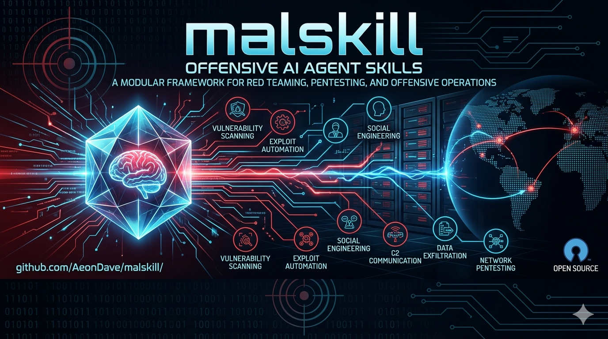

Full-spectrum security skill collection for AI agents - built on the open [AgentSkills](https://agentskills.io) specification.

Each skill is a self-contained folder with a `SKILL.md` that gives any AI agent deep domain knowledge: command syntax, real workflows, decision logic, edge cases, and operational caveats.

The collection covers the full range a security-focused agent needs: offensive tool execution, active exploitation, post-exploitation, credential attacks, defensive artifact analysis, malware understanding, private offensive CTF/lab solving, and the development workflows for building custom tooling. These categories are complementary - effective security work requires switching between attacker, analyst, developer, and lab-solving perspectives within a single task.

The repository is curated for offensive-security work first. Support areas such as `coding/`, `knowledge/`, `behaviours/`, `ai/`, `hardware/`, and `commands/` belong here only when they directly improve the active security task.

## Why Malskill? (The Agentic Paradigm)

Most public AI skill repositories fail because they treat LLMs like human students or hard drives. They dump 10,000-line SecLists payloads, massive tool manuals, and theoretical textbooks directly into the context window. This causes **Attention Dilution** and context collapse—the agent hallucinates, runs unauthorized destructive commands, or gets lost describing the history of a vulnerability instead of exploiting it.

Malskill is fundamentally different. It is engineered as a **Software Contract** for autonomous agents:
- **High Signal-to-Noise Ratio**: Zero theoretical fluff. Skills use rigid `Cognitive Stance -> The Loop -> Strict Rules` structures.
- **Negative Constraints**: LLMs are "eager to please" and often skip steps out of helpfulness. We use strict negative boundaries (*"Do not run scanners"*, *"Evidence First"*, *"Execute in /dev/shm"*) to prevent hallucination and enforce OPSEC.
- **Separation of Concerns**: We heavily separate **Roles** (Identity and Constraints), **Techniques** (Methodology), and **Tools** (Command execution). An agent loads only what it needs exactly when it's needed, keeping the context window pristine.
- **Methodology over Payloads**: Malskill doesn't feed static Wordlists into the prompt. It teaches the agent *where* to download them or *how* to use the host OS tools to iterate over them securely.

## Skill anatomy

- `SKILL.md` - baseline workflow, routing, and task guidance.
- `references/` - load-on-demand deep dives for specific subtasks; they extend the parent skill and should not act as README-style overviews, training material, or design rationale.
- `scripts/` - deterministic helpers the agent can run.
- `assets/` - templates or static supporting material.

---

## Categories

### `offensive-tools/` - Attack tool skills

One skill per tool, organized by attack phase. Each skill covers how the tool works, key flags, target scenarios, output parsing, and OPSEC notes.

This area is explicitly about **how to use a specific tool** to reach an objective.

| Subcategory | Examples |
|------------|---------|
| `windows/` | bloodhound, certipy, crackmapexec, impacket, mimikatz, rubeus |
| `vuln-scanners/` | burpsuite, dalfox, nuclei, sqlmap, testssl, trivy |
| `recon/` | dnsx, feroxbuster, gobuster, httpx, massdns, shodan |
| `network/` | chisel, ligolo-ng, masscan, mitmproxy, nmap, responder |
| `cryptography/` | rsactftool, sagemath, cyberchef |
| `web/` | commix, corsy, jwt-tool, smuggler, xsstrike, zap |
| `fuzzing/` | aflplusplus, arjun, boofuzz, dotdotpwn, ffuf, restler |
| `osint/` | amass, ghunt, maigret, phoneinfoga, spiderfoot, theharvester |
| `forensic/` | capa, tcpdump, volatility3, wireshark, yara, zeek |
| `rev/` | binaryninja, frida, gdb, ghidra, radare2, windbg |
| `wireless/` | aircrack-ng, kismet, lswifi, sparrow-wifi, wifite |
| `linux/` | linpeas, linux-persistence, mimipenguin, pwncat, ssh-key-scanner |
| `shells/` | reverse-ssh, revshells, shellerator, weevely3 |
| `cracking/` | hashcat, hydra, john |
| `exploits/` | beef, metasploit, searchsploit, vuln-research |

**Note on `forensic/`**: These skills exist because security work often requires analyzing artifacts produced by attacks - understanding what defenders see, recovering post-compromise evidence, assessing detection surface, and validating OPSEC. Tools like `volatility3`, `capa`, and `yara` are as useful for a red team operator understanding EDR behavior as they are for a blue team analyst.

### `offensive-coding/` - Offensive development skills

Skills for building offensive tooling from scratch: shellcode, loaders, BOFs, syscall stubs, evasion primitives, and Windows internals. Targeted at agents doing tool development, not just tool execution.

- **BOF**: `bof-dev/c-bof`, `bof-dev/cpp-bof` - Beacon Object File development workflows
- **Evasion**: `edr-evasion-dev`, `indirect-syscall-dev`, `sleep-masking-dev`, `stack-spoofing-dev` - technique-level development patterns
- **Exploit and payload development**: `heap-exploitation-dev`, `rop-development-dev`, `shellcode-dev`
- **Internals**: `windows-internals-dev`, `linux-internals-dev` - OS APIs, structures, and memory layout knowledge
- **C2**: `adaptixc2-dev` - framework-specific development

### `offensive-techniques/` - Methodology and tradecraft skills

This area is explicitly about **how to perform a technique in general**, independent of one specific tool.

- Includes strategy, process, decision flow, and workflow patterns.
- May mention which tools are suitable, but does **not** become a tool manual.

Example:

- `offensive-tools/fuzzing/` = *tool-level guides* (flags, command patterns, tool-specific tricks)
- `offensive-techniques/fuzzing-technique/` = *fuzzing methodology* (harnessing mindset, corpus strategy, campaign design, validation logic)

These two layers are complementary and intentionally separate.

### `offensive-roles/` - Supervisor and operator role skills

Mission-focused role skills for supervising and delegating offensive work across precise vertical operators. Roles compose `*-technique` methodology skills with optimized tool skills; they do not replace either layer.

| Skill | Role |
|-------|------|
| `offensive-supervisor-role` | OODA orchestrator. Owns mission, scope, delegation, and strict evidence gates |
| `offensive-recon-role` | Produces scoped target packages, asset inventory, and external attack-surface discovery |
| `offensive-osint-role` | Performs passive, zero-touch public-source, identity, and leaked-credential research |
| `offensive-web-role` | App-layer operator. Handles API mapping, input tampering, and OWASP-tier vulnerability validation |
| `offensive-cloud-role` | Cloud/SaaS/IAM operator. Focuses on principal identities, metadata endpoints, and blob storage |
| `offensive-windows-role` | Windows Operator. Handles AD enumeration, access tokens, IPC, and OPSEC-aware local escalation |
| `offensive-linux-role` | Linux Operator. Living-off-the-Land (LotL) execution, host triage, and Unix privilege escalation |
| `offensive-mobile-role` | Mobile Operator. Handles APK/IPA static analysis, traffic interception, and Frida instrumentation |
| `offensive-reverse-role` | Reverse Engineer. Static and dynamic analysis of binaries, malware, and unknown protocols |
| `offensive-hardware-role` | Hardware Operator. Physical device compromise via UART, JTAG, SPI, and embedded extraction |
| `offensive-forensic-role` | Forensic Operator. Extracts credentials and timelines from memory dumps, disk images, and PCAP |

### `offensive-ctf/` - Private offensive CTF and lab-solving skills

Challenge-solving workflows for flag-style objectives, puzzle-like artifacts, offline target bundles, and private lab scenarios. This area is intentionally separate from field methodology in `offensive-techniques/`.

- Dedicated `*-ctf` skills cover web, crypto, pwn, reverse, forensics, OSINT, AI/ML, malware, misc, ICS/OT, hardware/embedded, blockchain/Web3, and writeup workflows.
- Pick the category `*-ctf` that matches the dominant artifact; load multiple in parallel only when the bundle is genuinely cross-domain.

CTF skills may reference technique and tool skills, but they stay optimized for controlled lab objectives rather than real-world engagement tradecraft.

### `coding/` - Language patterns and tooling

Idiomatic code patterns, testing strategies, and performance guidance for the languages most used in security tooling. These skills give an agent the ability to write, review, and improve code - not just run existing tools.

- **Assembly** - x86-64/ARM64 patterns, syscall stubs, shellcode, evasion primitives, testing
- **C / C++** - safe patterns, modern idioms, fuzzing, sanitizers
- **Rust** - ownership, API design, performance, unsafe patterns
- **Go** - idiomatic patterns, concurrency, performance
- **Python** - patterns, async, pytest workflows
- **Cross-cutting** - TDD, testing reliability, and systematic debugging workflows

### `knowledge/` and `behaviours/` - Research and meta-skills

Skills that support the workflow itself: design, implementation planning, research, analysis, evidence quality, verification gates, orchestration, review triage, and documentation automation.

These categories are support layers. Load them when they improve the current offsec task, not as background reading.

| Skill | Role |
|-------|------|
| `skill-creator` | Create, validate, and package new skills |
| `agent-md-creator` | Bootstrap and maintain `AGENTS.md` files |
| `readme-md-creator` | Create and maintain high-signal README files |
| `design-before-implementation` | Clarify scope, alternatives, constraints, and success criteria before building |
| `implementation-planning` | Turn approved designs into executable, verifiable task plans |
| `evidence-before-claims` | Gate security claims on reproducible evidence and honest uncertainty |
| `verification-before-completion` | Require fresh verification before claiming work is done or fixed |
| `external-feedback-triage` | Verify reviews, scanner findings, PoCs, and model suggestions before acting |
| `deep-research-offensive` | File-backed offensive security research with source chaining |
| `deep-research-generic` | General-purpose deep research |
| `cve-search` | CVE enumeration and public PoC collection |
| `poc-weaponization` | Safely evaluate, adapt, and rewrite raw public proof-of-concepts |

### `ai/` - AI framework skills

- **`langchain-py`** - Production-oriented LangChain Python workflows

### `hardware/` - Embedded skills

- **`arduino`**

### `commands/` - Agent behavior and command modes

- **`1337`** - Ultra-compressed offensive operator mode for maximum signal/token efficiency

---

## Quick start

```bash
# Clone
git clone <repo-url> && cd malskill

# Interactive install (choose skills, destination, format, layout)
./install.sh        # Bash
.\install.ps1       # PowerShell

# Install a single skill (copy folder into agent skill directory)
cp -r offensive-tools/windows/mimikatz ~/.agents/skills/

# Install all offensive-tools skills
cp -r offensive-tools/*/* ~/.agents/skills/

# Install all private offensive CTF skills
cp -r offensive-ctf/* ~/.agents/skills/

# Install with layout preservation (group by category)
./install.sh --skills offensive-tools/windows/mimikatz --format folder --layout group --destination ~/.agents/skills
```

Skills are plain folders - no build step, no runtime dependency. Copy a skill folder into wherever your agent reads skills from and it activates automatically.

**Supported output formats:**
- `folder` - copies the skill directory directly
- `.skill` - distributable archive (standard zip, preserves skill folder name)
- `zip` - standard zip with same contents

**Supported install layouts:**
- `flat` - all selected skills directly under destination root
- `group` - preserves category structure under destination root

---

## Validation

```bash
# Validate a single skill
python knowledge/skill-creator/scripts/quick_validate.py offensive-tools/windows/mimikatz

# Check changed files for final newlines and git diff whitespace issues
python knowledge/skill-creator/scripts/check_changed_files.py

# Validate an entire section (Bash)
find offensive-tools/windows -type f -name SKILL.md -exec dirname {} \; | sort -u | \
  while IFS= read -r dir; do python knowledge/skill-creator/scripts/quick_validate.py "$dir"; done

# Validate an entire section (PowerShell)
Get-ChildItem offensive-tools/windows -Directory | ForEach-Object {
  python knowledge/skill-creator/scripts/quick_validate.py $_.FullName
}

# Package a skill into a .skill archive
python knowledge/skill-creator/scripts/package_skill.py offensive-tools/windows/mimikatz
```

---

## Scope boundary (important)

- Put a skill in `offensive-tools/` when the core question is: **"How do I use this specific tool well?"**
- Put a skill in `offensive-techniques/` when the core question is: **"How do I perform this technique well, regardless of tool?"**
- Put a skill in `offensive-ctf/` when the core question is: **"How do I solve this controlled lab, challenge, or flag-style objective?"**

Do not mix these purposes in the same skill. Keep real-world tradecraft in `offensive-techniques/`, tool manuals in `offensive-tools/`, and lab/challenge solving in `offensive-ctf/`.

Every skill folder contains at minimum a `SKILL.md` with valid YAML frontmatter. Some also include `scripts/` for automation helpers, `references/` for subtask-specific deep dives loaded on demand, and `assets/` for templates.
