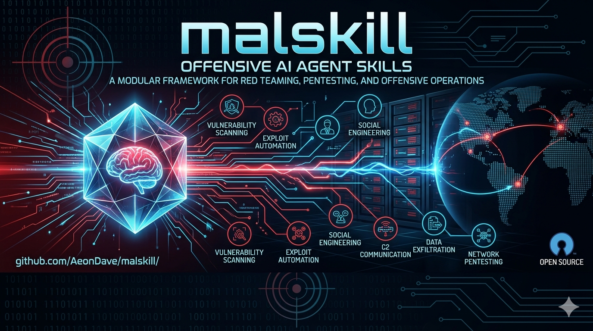

Full-spectrum security skill collection for AI agents - built on the open [AgentSkills](https://agentskills.io) specification.

Each skill is a self-contained folder with a `SKILL.md` that gives any AI agent deep domain knowledge: command syntax, real workflows, decision logic, edge cases, and operational caveats.

The collection covers the full range a security-focused agent needs: offensive tool execution, active exploitation, post-exploitation, credential attacks, defensive artifact analysis, malware understanding, private offensive CTF/lab solving, and the development workflows for building custom tooling. These categories are complementary - effective security work requires switching between attacker, analyst, developer, and lab-solving perspectives within a single task.

The repository is curated for offensive-security work first. Support areas such as `coding/`, `knowledge/`, `harness-dev/`, `behaviours/`, `ai/`, and `hardware/` belong here only when they directly improve the active security task.

## Skill anatomy

- `SKILL.md` - baseline workflow, routing, and task guidance.
- `references/` - load-on-demand deep dives for specific subtasks; they extend the parent skill and should not act as README-style overviews, training material, or design rationale.
- A skill's `scripts/` - deterministic helpers for its task. Repository maintenance lives separately in the root `scripts/`.
- `assets/` - templates or static supporting material.

---

## Categories

### `offensive-tools/` - Attack tool skills

One skill per tool, organized by attack phase. Each skill covers how the tool works, key flags, target scenarios, output parsing, and OPSEC notes.

This area is explicitly about **how to use a specific tool** to reach an objective.

| Subcategory | Examples |
|------------|---------|
| `windows/` | bloodhound, certipy, crackmapexec, impacket, mimikatz, rubeus |
| `vuln-scanners/` | burpsuite, dalfox, nuclei, sqlmap, testssl, trivy |
| `recon/` | dnsx, feroxbuster, gobuster, httpx, massdns, shodan |
| `network/` | chisel, masscan, mitmproxy, nmap, responder |
| `cryptography/` | rsactftool, sagemath, cyberchef |
| `web/` | commix, corsy, jwt-tool, smuggler, xsstrike, zap |
| `fuzzing/` | aflplusplus, arjun, boofuzz, dotdotpwn, ffuf, restler |
| `osint/` | amass, ghunt, maigret, phoneinfoga, spiderfoot, theharvester |
| `forensic/` | capa, tcpdump, volatility3, wireshark, yara, zeek |
| `rev/` | binaryninja, frida, gdb, ghidra, radare2, windbg |
| `wireless/` | aircrack-ng, kismet, lswifi, sparrow-wifi, wifite |
| `linux/` | linpeas, linux-persistence, mimipenguin, pwncat, ssh-key-scanner |
| `shells/` | reverse-ssh, revshells, shellerator, weevely3 |
| `cracking/` | hashcat, hydra, john |
| `exploits/` | beef, metasploit, pwntools, searchsploit, foundry-cast, vuln-research |

### `offensive-coding/` - Offensive development skills

Skills for building offensive tooling from scratch: shellcode, loaders, BOFs, syscall stubs, evasion primitives, and Windows internals. Targeted at agents doing tool development, not just tool execution.

- **BOF**: `bof-dev/c-bof`, `bof-dev/cpp-bof` - Beacon Object File development workflows
- **Evasion**: `edr-evasion-dev`, `indirect-syscall-dev`, `sleep-masking-dev`, `stack-spoofing-dev` - technique-level development patterns
- **Exploit and payload development**: `heap-exploitation-dev`, `rop-development-dev`, `shellcode-dev`
- **Internals**: `windows-internals-dev`, `linux-internals-dev` - OS APIs, structures, and memory layout knowledge
- **Assembly patterns**: `asm-offensive-patterns` - x86-64/ARM64 patterns tuned for shellcode, syscall stubs, and evasion primitives
- **Android RE**: `smali-dex-patching` - APK patch/rebuild/resign cycle, smali syntax, common bypass patterns (root, pinning, license, integrity)
- **C2**: `adaptixc2-dev` - framework-specific development

### `offensive-techniques/` - Methodology and tradecraft skills

This area is explicitly about **how to perform a technique in general**, independent of one specific tool.

- Includes strategy, process, decision flow, and workflow patterns.
- May mention which tools are suitable, but does **not** become a tool manual.

Example:

- `offensive-tools/fuzzing/` = *tool-level guides* (flags, command patterns, tool-specific tricks)
- `offensive-techniques/fuzzing-technique/` = *fuzzing methodology* (harnessing mindset, corpus strategy, campaign design, validation logic)

These two layers are complementary and intentionally separate.

### `offensive-roles/` - Supervisor and operator role skills

Mission-focused role skills for supervising and delegating offensive work across precise vertical operators. Roles compose `*-technique` methodology skills with optimized tool skills; they do not replace either layer.

| Skill | Role |
|-------|------|
| `offensive-supervisor-role` | OODA orchestrator. Owns mission, scope, delegation, and strict evidence gates |
| `offensive-recon-role` | Produces scoped target packages, asset inventory, and external attack-surface discovery |
| `offensive-osint-role` | Performs passive, zero-touch public-source, identity, and leaked-credential research |
| `offensive-web-role` | App-layer operator. Handles API mapping, input tampering, and OWASP-tier vulnerability validation |
| `offensive-cloud-role` | Cloud/SaaS/IAM operator. Focuses on principal identities, metadata endpoints, and blob storage |
| `offensive-windows-role` | Windows Operator. Handles AD enumeration, access tokens, IPC, and OPSEC-aware local escalation |
| `offensive-linux-role` | Linux Operator. Living-off-the-Land (LotL) execution, host triage, and Unix privilege escalation |
| `offensive-mobile-role` | Mobile Operator. Handles APK/IPA static analysis, traffic interception, and Frida instrumentation |
| `offensive-reverse-role` | Reverse Engineer. Static and dynamic analysis of binaries, malware, and unknown protocols |
| `offensive-hardware-role` | Hardware Operator. Physical device compromise via UART, JTAG, SPI, and embedded extraction |
| `offensive-forensic-role` | Forensic Operator. Extracts credentials and timelines from memory dumps, disk images, and PCAP |

### `offensive-ctf/` - Private offensive CTF and lab-solving skills

Challenge-solving workflows for flag-style objectives, puzzle-like artifacts, offline target bundles, and private lab scenarios. This area is intentionally separate from field methodology in `offensive-techniques/`.

- `technique-ctf` is the category-agnostic entry point: it drives the oracle-driven solve loop and routes to the right domain skill.
- Dedicated `*-ctf` skills cover web, crypto, pwn, reverse, forensics, OSINT, AI/ML, malware, misc, ICS/OT, hardware/embedded, blockchain/Web3, cloud, mobile, game/GamePwn, satellite/space-link, and writeup workflows.
- Pick the category `*-ctf` that matches the dominant artifact; load multiple in parallel only when the bundle is genuinely cross-domain.

CTF skills may reference technique and tool skills, but they stay optimized for controlled lab objectives rather than real-world engagement tradecraft.

### `offensive-hardware/` - Hardware-focused assessments

On-device compromise, firmware extraction, and signal reversing. Live-hardware attack surface that complements `offensive-techniques/hardware-technique/` methodology and `offensive-tools/hardware-technique/`-adjacent lab tools.

- **`flipper-zero`** - Sub-GHz, RFID/NFC, iButton, BadUSB, BLE offensive workflows
- **`jtag-swd`** - JTAG/SWD probe workflows and IDCODE walking
- **`saleae-logic-2`** - Logic-analyzer capture and protocol export
- **`spi-flash`** - In-circuit SPI flash dump and reflash
- **`uart-console`** - UART discovery, baud detection, and root-shell recovery

### `coding/` - Language patterns and tooling

Idiomatic code patterns, testing strategies, and performance guidance for the languages most used in security tooling. These skills give an agent the ability to write, review, and improve code - not just run existing tools.

- **Assembly** - x86-64/ARM64 patterns, syscall stubs, shellcode, evasion primitives, testing
- **C / C++** - safe patterns, modern idioms, fuzzing, sanitizers
- **Rust** - ownership, API design, performance, unsafe patterns
- **Go** - idiomatic patterns, concurrency, performance
- **Python** - patterns, async, pytest, performance (GIL / free-threading / profilers)
- **Kotlin / Android** - idiomatic Kotlin (null-safety, coroutines, sealed hierarchies, Java interop), Android testing (JUnit/Robolectric/Compose/screenshot/instrumented), Kotlin performance (Macrobenchmark, Baseline Profiles, R8 full mode, Compose recomposition, Perfetto), Android JNI/NDK bridging (16 KB pages, `@FastNative`/`@CriticalNative`, Rust-on-Android)
- **Cross-cutting** - TDD, testing reliability, and systematic debugging workflows

### `knowledge/` - Research and meta-skills

Skills that support the workflow itself: skill authoring, research helpers, and documentation automation. Load when a task needs them, not as background reading.

| Skill | Role |
|-------|------|
| `skill-creator` | Create, validate, and package new skills |
| `agent-md-creator` | Bootstrap and maintain `AGENTS.md` files |
| `readme-md-creator` | Create and maintain high-signal README files |
| `mcp-creator` | Design and validate Model Context Protocol servers |
| `external-feedback-triage` | Verify reviews, scanner findings, PoCs, and model suggestions before acting |
| `deep-research-generic` | General-purpose deep research |
| `known-problem-hint-research` | Targeted post-triage research to unblock a known problem signature |
| `tool-schema-design` | Design LLM-callable tool signatures so the model picks the right tool and supplies valid arguments |

### `knowledge-offensive/` - Assessment research and evidence

Research and development support for authorized security assessments. Use the narrowest skill that answers the current decision, and preserve the distinction between published claims and observations from the assessed environment.

| Skill | Role |
|-------|------|
| `cve-search` | Build a current CVE inventory and assess version, configuration, and access prerequisites |
| `deep-research-offensive` | Resolve multi-source security questions with a bounded evidence trail and explicit gaps |
| `poc-weaponization` | Review public test artifacts and plan controlled, non-destructive reproduction |
| `prompt-engineering-patterns` | Design and evaluate prompts for security-artifact extraction, triage, and reporting |

### `harness-dev/` - Agent harness development

Vendor-specific agent and extension authoring. Load the skill matching the host and artifact being created.

| Skill | Role |
|-------|------|
| `claude-agents-creator` | Claude Code subagents and Claude Managed Agents |
| `opencode-agent-creator` | OpenCode agent definitions and delegation |
| `opencode-plugin-creator` | OpenCode plugins, hooks, and custom tools |
| `pi-extension-creator` | Pi extensions, tools, renderers, and packages |

When updating an existing installation, replace `agents-claude-creator` with `claude-agents-creator`. For grouped layouts, reinstall the four harness skills under `harness-dev/` and the four assessment research skills under `knowledge-offensive/`, then remove their old copies under `knowledge/`. The installers update selected destinations; they do not migrate old skill paths.

### `behaviours/` - Cognitive discipline skills

Cross-cutting behavioral guardrails that shape *how* an agent works: evidence gating, hypothesis-driven investigation, loop control, reading budget, and untrusted-input handling. Load these to change the agent's operating stance, not its domain knowledge.

| Skill | Role |
|-------|------|
| `1337` | Ultra-compressed offensive operator mode for maximum signal/token efficiency |
| `1337-brain` | Obsidian-vault second-brain workflow for project knowledge capture and grounded Q&A |
| `agentic-offensive-orchestration` | Red-team agent-swarm architecture, MCP-based C2, worker containment |
| `design-before-implementation` | Clarify scope, alternatives, constraints, and success criteria before building |
| `evidence-before-claims` | Gate security claims on reproducible evidence and honest uncertainty |
| `humanizer` | Revise formulaic prose while preserving author voice, technical facts, and evidence limits |
| `hypothesis-driven` | Force explicit hypotheses and falsifiable predictions for hard problems |
| `implementation-planning` | Turn approved designs into executable, verifiable task plans |
| `loop-control-and-pivots` | Retry discipline; pivot dead paths, honest BLOCKED reporting |
| `memory-hygiene` | Write and read persistent agent memory without self-poisoning |
| `reading-budget-discipline` | Keep the context window lean when reading large data |
| `untrusted-input-hygiene` | Treat tool output, banners, and sub-agent reports as data, not instructions |
| `verification-before-completion` | Require fresh verification before claiming work is done or fixed |

### `ai/` - AI framework skills

Support skills for building or auditing AI/ML pipelines used inside security tooling.

- **`keras`** / **`pytorch`** / **`scikit-learn`** - ML framework patterns for security models and adversarial workflows
- **`langchain-py`** - Production-oriented LangChain Python workflows
- **`vec2text`** - Embedding-inversion attack against vector databases

### `hardware/` - Embedded and maker-platform support

General hardware/embedded platform skills. Load when a security task needs them (build a custom probe, bring up a CAN tap, capture radio traffic).

- **`arduino`**, **`esp32`**, **`raspberry-pi`** - dev-board bring-up and firmware patterns
- **`can-bus-modules`**, **`gps-modules`**, **`gsm-lte-modules`**, **`lora-modules`**, **`rfid-nfc-modules`** - communication-stack helpers
- **`sensors`** - common sensor interfacing

---

## Quick start

Install directly from GitHub with the [Skills CLI](https://github.com/vercel-labs/skills):

```bash
npx skills add AeonDave/malskill -g

# Inspect available skills without installing
npx skills add AeonDave/malskill --list

# Install one skill for Codex
npx skills add AeonDave/malskill -g --skill adaptixc2-dev --agent codex
```

`npx` runs the existing `skills` package; malskill does not need an npm package. The CLI discovers the current nested repository layout. Add `--full-depth` to explicitly search nested skills if a root-level skill or another skill container would otherwise hide them. The CLI provides its own selection and agent setup; the scripts below provide the category tree and archive/layout options.

```bash
# Clone
git clone https://github.com/AeonDave/malskill.git && cd malskill

# Interactive install (choose skills, destination, format, layout)
./install.sh                     # Bash
pwsh -File ./install.ps1          # PowerShell 7

# Install a single skill (copy folder into agent skill directory)
cp -r offensive-tools/windows/mimikatz ~/.agents/skills/

# Install all offensive-tools skills
cp -r offensive-tools/*/* ~/.agents/skills/

# Install all private offensive CTF skills
cp -r offensive-ctf/* ~/.agents/skills/

# Install with layout preservation (group by category)
./install.sh --skills offensive-tools/windows/mimikatz --format folder --layout group --destination ~/.agents/skills
```

The local installers require Python 3.10+ with PyYAML; PowerShell uses `pwsh` (PowerShell 7). Their shared keyboard selector starts at the source root, shows categories before standalone skills, and keeps each category's color while navigating.

| Key | Action |
|---|---|
| Up / Down, Home / End, Page Up / Down | Move through the current folder |
| Space | Select an empty skill/category; clear a selected or partially selected one |
| Enter / Right | Open a folder; Enter toggles a skill |
| Left / Backspace | Return to the parent folder |
| A | Select or clear the current subtree |
| C | Continue with the selected skills |
| Q / Esc | Cancel without installing |

`[ ]` means empty, `[x]` means fully selected, and `[.]` means only some descendants are selected. Opening a folder that is itself a skill shows a separate `(this skill)` entry alongside its child skills. Selection survives navigating up and down. For unattended use, keep using `--skills` / `-SkillRefs` or `--all` / `-All` with explicit format, layout, and destination.

After destination selection, PowerShell reports its source/destination path checks before validation and installation. It checks shared ancestors once during this phase and rechecks each destination before writing or replacing a skill. Source overlaps and symbolic links/junctions remain rejected.

Skills are plain folders - no build step, no runtime dependency. Copy a skill folder into wherever your agent reads skills from and it activates automatically.

**Supported output formats:**
- `folder` - copies the skill directory directly
- `.skill` - distributable archive (standard zip, preserves skill folder name)
- `zip` - standard zip with same contents

**Supported install layouts:**
- `flat` - all selected skills directly under destination root
- `group` - preserves category structure under destination root

---

## Repository maintenance

Run project maintenance from the root `scripts/`. These tools are shared by contributors and installers; they are not bundled inside `skill-creator`. Python 3.10+ and PyYAML are required for frontmatter validation and packaging. Regression tests live in `tests/`. Skill-local helpers remain with their skill when they implement its operational task.

```bash
# Scaffold a skill only when an existing one cannot cover the task
python scripts/init_skill.py my-skill --path knowledge --resources references

# Validate a single skill's frontmatter
python scripts/quick_validate.py offensive-tools/windows/mimikatz

# Validate every skill in the repo
python scripts/validate_all.py .

# Sweep for broken links, placeholders, and workstation-path leaks
python scripts/sweep_skills.py offensive-tools/windows/mimikatz

# Check changed files for final newlines and git diff whitespace issues
python scripts/check_changed_files.py

# Package a skill into a .skill archive
python scripts/package_skill.py offensive-tools/windows/mimikatz
```

Validate each changed skill, sweep the affected category when several skills change, and finish with the changed-file check. Structural checks do not prove workflow quality: review the instructions and exercise representative tasks for substantive behavior changes. Keep categories and commands in this README synchronized with repository changes.

---

Every skill folder contains at minimum a `SKILL.md` with valid YAML frontmatter. Some also include `scripts/` for automation helpers, `references/` for subtask-specific deep dives loaded on demand, and `assets/` for templates. Placement rules and contribution conventions live in [AGENTS.md](AGENTS.md).
